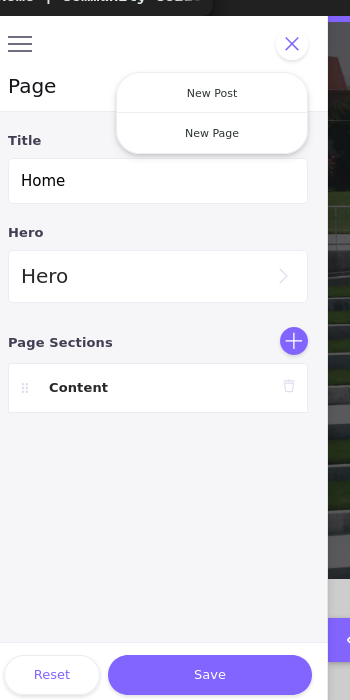
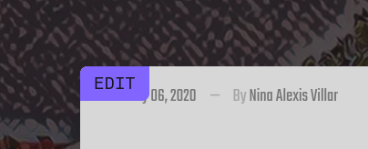
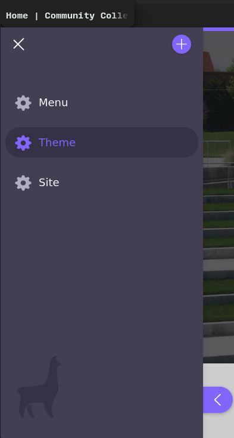
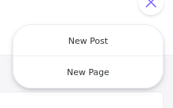

# Group 5 Submission

This repository contains the files to be submitted for Group 5

[Site Hosted Here](https://g5-blog-cclife.netlify.app/)

---

## For the Instructor 
**Hello Instructor,**
 
This is intended to serve as an introduction to how to access the
features of the site both publically viewable, and those that would be 
hidden from users if this mock up were real. It should also help explain 
to you various aspects of the site and why the choices were made the way
they were leading to the 
site before you now.

## Set Up
In order to manipulate the site's cms features the following steps are 
required to produce the development server and run it locally. 

- Install Node.js for your platform (Node Version Manager Highly Recommended) 
- open a terminal/command line
- navigate to this folder/directory
- run `npm i -g yarn`
- run `yarn install`
- run `yarn develop`
- open browser to http://localhost:8000

### Source Code 

#### Javascript Version // Library
The site utilizes and conforms to the conventions of the React
library/framework which is a library enabling the construction of
Javascript as a series of components, isolating various logical aspects
of the application in a modular format. The files written in this Javascript variant are across the `src` folder.

In combination with React, a lot of the logic that is utilized within 
this site is derived from Node.js and is wrapped in React components, or
site configuration files, determining which is clearly node vs. node+configuration is hard to do, as they are isolated into functional
portions due to the React development pattern, otherwise I would 
specify an example. 

In order to be readable by client machines, which React is not, it is *transpiled* into Javascript by Babel. This also makes the source code 
compliant with older browsers, turning ES6 & ES7 into vanilla JS. 

#### Styled Components
Breaking from tradition and my standard workflow, we decided to write the stylesheet in Styled Components, an extremely ugly but effective means of injecting CSS into the HTML rendered out of the React (where it is called JSX). While being both ugly and sometimes cumbersome, it enabled the styling of various components I could not access with my typical SCSS means of creating a stylesheet. 

The CSS itself is either at the bottom of a React file with the general CSS provided by the component `src/component/Styles`

#### Static Site Generator
This site is additionally processed by an application called Gatsby.js which takes the components and JSON files within `content/pages` and renders them into HTML5 and CSS3. This means that the server is just caching a series of HTML and CSS files that user's request, saving hardware resources and making it so that the developer may add a content manager for writers to add content without need to edit source code. 

As input, template files create content blocks, which then are called by the `content/pages` files and these are all wrapped within configurations provided in `src/components/pageLayout` and `src/components/siteLayout` that includes the React Helmet package enabling the modification of the generated head element in the generated html that enables SEO in the generated site, an otherwise impossible task. 

Configuration is provided in the files `gatsby-config.js`, `gatsby-browser.js` and `gatsby-node.js` which include a list of additional plugins added to the SSG to extend its functionality, such as reading the Markdown files, adding in images, etc. 

#### Markdown 
The articles are written in Markdown, a quick markup that utilizes HTML
elements ergonomically. They are taken as input by the SSG to dynamically produce pages for each in the generated code. 

### CMS

The Content Management System that is being utilized by this site is not
so much a full page as it is a sidebar available to the user on the 
development side. For
the sake of completing the assignment, we opted not to configure a 
separate URL to host the development server to edit the content, which 
would have required 
several additional authentication hoops and for a blog utilizing this 
CMS, it seems this method is the only viable option other than what they
style Open Authoring, which would enable anyone to edit content and 
submit it as a pull request to the repository hosting the site, which at
present only seems to work with a different static site generator, 
Next.js.

#### Features

- Live Editing Content
    - Editing Tabs on Articles Content 
- Page and Site Editing 
    - Theme Editing 
    - Modifications of the Site's General Configuration
   
#### Screenshots

    

