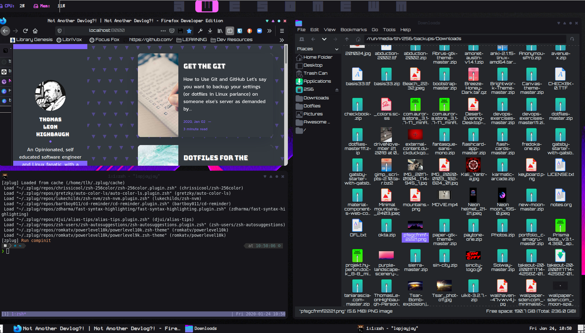

## Dotfiles: The What

So maybe you have seen my ultra cool Linux set up and are wondering how I did all that, or maybe you have seen me running a script when configuring a new system and wondered how I got the system to my specific configuration.

Well the reason I am able to take my configuration across my systems is because all of the systems I use, I have the same configuration files, aka dotfiles that I deploy across the systems I use.

## Dotfiles: The Why?

The why is to decrease the time it takes for me to restore myself to working order when reinstalling my OS (generally after experimenting gone wrong) or when using a new system.

Using these files also creates visual consistency and in the case of my current window manager (Awesome WM) both the aesthetics and the functionality are dependent upon this configuration, thus it is an absolute necessity to have a means of redeploying my configuration (especially because the default is awful).

## Dotfiles: The How

This is the first of several articles in which I will describe how exactly I create, manage and backup my dotfiles, so check out subsequent articles for more on each step but here is a general overview

Note: I use Linux exclusively, though some of these steps will work with Windows and almost all will work with macOS with some variation. Unless someone wants to give me either system to rewrite these, you will have to do the porting yourself, sorry!

1. Determine What Configurations You Modify and Should Back Up
2. Create the GitHub repo
3. Create the Makefile
4. Move configurations to the git repo
5. Run Makefile to syslink the files to their original location
6. Explore Other Dotfiles Repos
7. Modify-Rinse-Repeat
