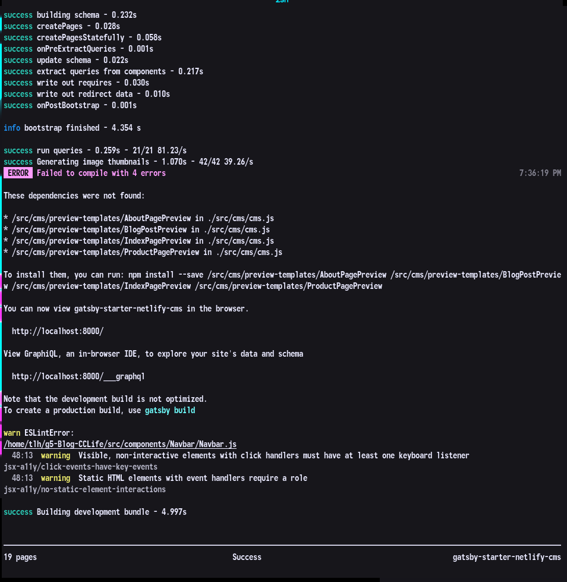

--- 
title: Local Development 

--- 

# Local Development

So in order to help, you have to be able to work on the thing right? Well don't worry I can walk you through the basics of that process. Your work flow may look different depending on your code editor but I will try to make this as IDE-agnostic as is possible.

I am going to assume you are using a system with BASH on it in some capacity. I know little of the Windows-Linux dark arts that is the Linux Subsystem on Windows but from what I have heard it provides a command line which is 99% likely to be BASH (or ZSH which won't make a difference in these instructions, I run ZSH actually)

There is also the option of using Virtualbox and spinning up a virtual linux OS, like Manjaro or Ubuntu, on your Windows machine which would probably be clunky but would also suffice. I would not reccomend you try this in Docker, not because it wouldn't build the application but because it would make working with the code a terminal application only affair and probably you aren't very practiced in the ways of VIM, but if you are then there is that option. 

## Git the Project
The best way is to make a github account then navigate to the repo [here](https://github.com/Thomashighbaugh/g5-Blog-CCLife) and click the button that says `fork`. That will copy the repo to your repositories and you can download it locally using the site's GUI, push your changes from there and use the nifty web interface to submit those changes as pull requests. But if for whatever reason you would rather not do it that way there is another option:

```bash
# this is a terminal commands that will copy the repository into your current directory,
# run them one by one and it should create a copy locally that you can then link to github later

git clone https://github.com/Thomashighbaugh/g5-Blog-CCLife

# Navigate to the repository

cd g5-Blog-CCLife


```

## Rendering the Development Version of the Site

### A Little Background on What the Hell All This Even Is
We are using a static site generator that turns React components (fancy blobs of Javascript) into HTML and CSS that is easily run on a remote server with minimal resources required. In most other contexts, React goes through a process called *transpiling* where it is turned into Javascript in its vanilla form by a program called Babel ()which we don't even have to worry about for our purposes). Thus even if you tried to run any of the React in the browser, it would not know what to do with it because browsers lag behind the modern features of the Javascript language as it is expounded by the EMCA crew for purposes of still being able to show grandma her webpages when she still uses Internet Explorer from the early 2000s. Thus Babel sees use in a lot of contexts, because all of the new features developers want to use all can also be written in the older JS standards which is exactly what Babel takes care of, as does Gatsby which takes that a step further and turns the JS (and SCSS in our case) into plain old HTML and CSS that is supported everywhere, meaning we won't even need to think about what browsers will suppoort the site as most will naturally. 

### Installing the node_modules
The first step to getting the site to render locally is you must pull in the node packages that are required to build it. These will live in a directory called `node_modules** and be a swarming mass of directories you need not tread into very often thankfully. ****Node.js** is another variant of Javascript and comes bundled with a package manager that is somewhat like RubyGem, PHP comporsure, etc. This is why in the introduction I asked you to install it because the bundled package manager is the lynchpin to getting this thing to renderl.

```bash
# First install Facebook's Yarn Package Manager, the slightly less crappy one for Node.js 
npm install --global yarn 

# Now assuming you're still in the project directory we are going to pull in the packages using the list 
# provided in the files: package.json && yarn.lock 
yarn 

```

If all went well thus far, a whole bunch happened on the terminal in front of you. If it didn't end in an error code, ignore its additional output and we are almost there!

### Run the Development Server
The **Development Server** runs the commands that the host server will run, in a slightly looser way, and produces for you a port off of your localhost (the system you are using as it knows itself in the server sense) that allows you to navigate to it on the browser. 


```bash

# Run the dev server (assumes you are still in the project directory)

yarn develop 
```

Now another whole mess of dialog will flash by at light speed and it should have some centered text that says "SUCCESS" if everything went as I hope it does. If it didn't, try the process on a VM or another system to make sure its not some configuration problem as the first step to debugging. If it works elsewhere, its your machine's configuration otherwise we have a big old problem. 

Now assuming it said success, scroll up slightly in the terminal and click the hyperlink which should open your default browser to a locally rendered version of the site
